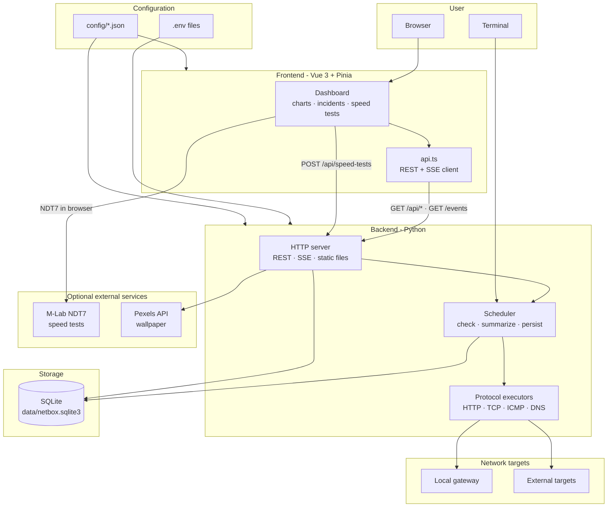
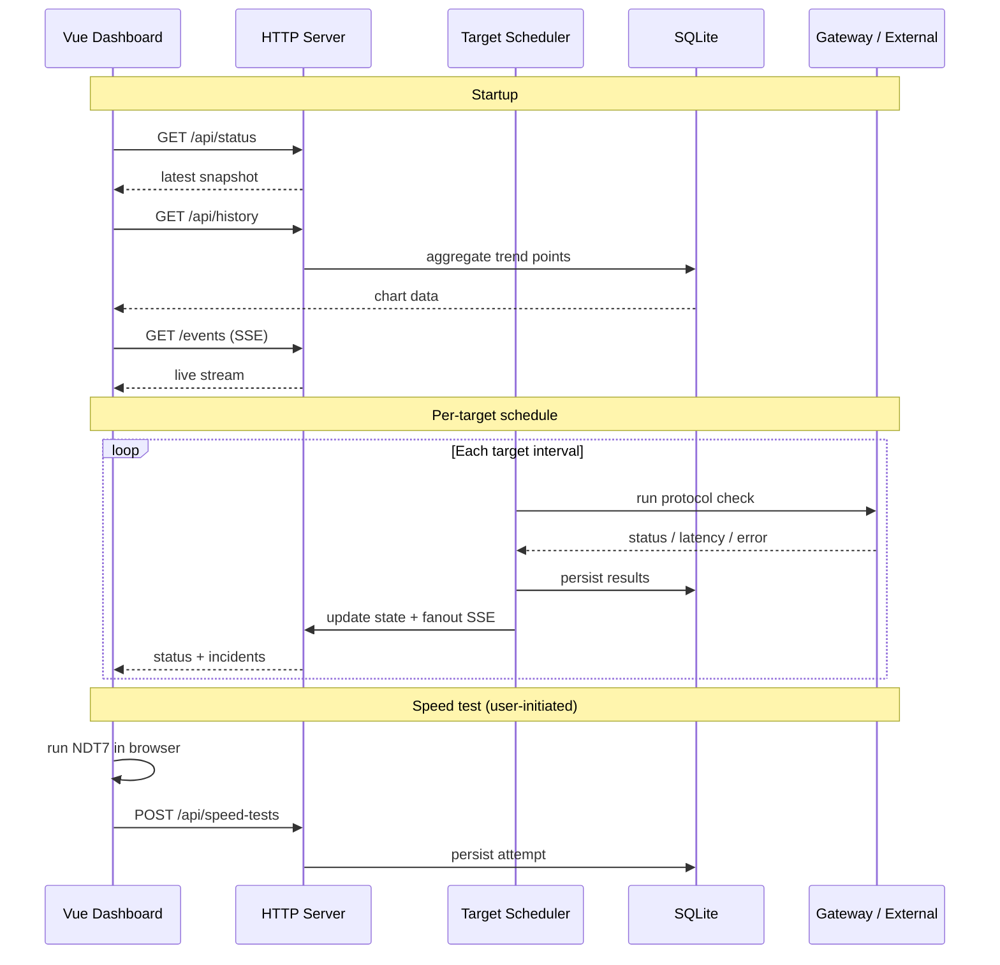
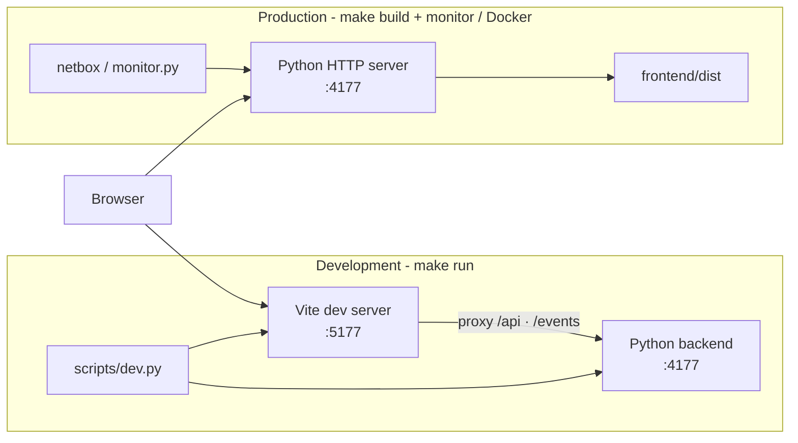

# Architecture

## Overview

Netbox is split into a small Python backend and a Vite/Vue frontend.

```text
backend/monitor.py          Local backend entrypoint
backend/src/netbox/
  config.py                 Dotenv + JSON configuration loading
  cli.py                    Argument parsing, validation, process lifecycle
  server/                   HTTP routing dispatch, handler, static files, SSE
  state.py                  Thread-safe monitor state and SSE fanout
  scheduler.py              In-process per-target scheduler with jitter
  storage/                  SQLite persistence package (targets, history, events, pruning)
  targets.py                Target validation and seed normalization
  checks.py                 HTTP/S, TCP, ICMP, and DNS executors
  ping.py                   Platform-specific ping execution and parsing
  summary.py                Status aggregation, diagnosis, events, history
  network.py                Gateway, interface, and Wi-Fi identity detection
  validation.py             Host/port/target validation
  speed.py                  Speed-test payload validation and policy
  wallpaper.py              Pexels wallpaper proxy for the dashboard
frontend/src/
  App.vue                   Dashboard composition and live state
  api.ts                    REST/SSE client with loading-tracked fetch helpers
  chart.ts                  No-grid degradation chart geometry
  format.ts                 Pure formatting helpers
  range.ts                  Date-range parsing and query params
  speed-test.ts             Browser-side M-Lab NDT7 orchestration
  theme.ts                  Theme preference helpers
  wallpaper.ts              Wallpaper preference and body styling
  types.ts                  API contracts
  components/               Dashboard sections, app chrome, UI primitives
  composables/              Theme, wallpaper, API loading, section collapse
  stores/                   Pinia stores for monitor, history, speed tests, prefs
config/
  backend.json              Backend, monitor, storage, network defaults
  frontend.json             Vite app/proxy defaults
  security.json             Bind allow-list and security headers
  targets.json              Default target seeds for first startup
  speed.json                Active speed-test provider policy
```

## High-Level Architecture

### 1. System overview

Netbox is a local-first monitor: the backend runs configurable HTTP/S, TCP, ICMP, and DNS checks from your machine, persists every result in SQLite, and serves a Vue dashboard over REST and SSE.



### 2. Runtime flow

On startup the dashboard hydrates from the API, then stays live via SSE while the backend scheduler runs enabled targets on their own intervals.



### 3. Deployment modes

Development runs two processes with hot reload; production serves the built frontend from the backend (or a Docker container).



## Runtime Flow

1. CLI loads `.env`, optional `.env.<NETBOX_ENV>`, and `config/*.json`, then validates the merged runtime configuration.
2. `config/targets.json` and CLI target args are normalized into target seeds, then inserted into SQLite only when the target id is missing.
3. The scheduler runs enabled targets on their own intervals with a bounded worker pool and small jitter.
4. Protocol executors return normalized results: HTTP/S status and optional keyword checks, TCP connect timing, ICMP via safe subprocess ping, and DNS resolution via `dnspython`.
5. Results are persisted to SQLite and summarized into component status, uptime, latency, history bars, and incident events.
4. The backend serves:
   - `GET /api/status` for the latest snapshot.
   - `GET /api/history?points=360` for persisted degradation trend points.
   - `GET /api/targets`, `POST /api/targets`, `PATCH /api/targets/{id}`, and `DELETE /api/targets/{id}` for target CRUD.
   - `POST /api/targets/{id}/check-now` and `GET /api/targets/{id}/results` for ad-hoc checks and raw result history.
   - `GET /api/targets/history` for per-target breakdowns.
   - `GET /api/incidents` for durable incident windows.
   - `GET /api/events` for paginated incident logs.
   - `GET` and `POST /api/speed-tests` for speed-test policy, history, and recording.
   - `GET` and `PATCH /api/preferences` for UI preference sync.
   - `GET /api/storage` and `POST /api/storage/clear` for retention visibility and manual cleanup.
   - `GET /api/wallpaper` for optional Pexels backgrounds.
   - `GET /events` for server-sent events.
   - Vite-built static assets from `frontend/dist`.
5. The Vue app hydrates from `/api/status`, draws the persisted no-grid line chart from `/api/history`, and updates live via `/events`.

By default the monitor runs indefinitely until the process stops. `--duration` can still be used for bounded runs. Indefinite runs retain a rolling in-memory sample window controlled by `--retention-points` to avoid unbounded memory growth, while long-term trend data is stored in SQLite at `data/netbox.sqlite3` unless `--db-path` overrides it.

## Configuration Flow

Configuration is intentionally layered:

1. Shell environment variables for deployment overrides.
2. `.env`, `.env.local`, `.env.<NETBOX_ENV>`, and `.env.<NETBOX_ENV>.local` for environment defaults.
3. `config/*.json` for structured project defaults.
4. Safe code fallbacks for resilience when a config file is absent.

The backend resolves relative paths against the project root, validates bind hosts through `config/security.json`, applies configured security headers to every HTTP response, and reads default external targets from `config/targets.json`. The frontend Vite config reads the same root dotenv values and `config/frontend.json`, so `make run`, Vite HMR, and backend proxy settings stay in sync.

Secrets such as `PEXELS_API_KEY` belong in `.env.local` only. `.env` and `.env.production` are gitignored local/runtime files; `.env.example` is the committed template.

## Persistence

SQLite stores target configuration in `monitor_targets`, one row per generalized check in `check_results`, legacy-compatible ping rows in `ping_results`, durable incident windows in `incidents`, and status transitions in `status_events`. UI preferences live in `ui_preferences` as a merged JSON document.

The history endpoint groups recent check timestamps and returns:

- `severity`: max status severity across targets, where operational is `0`, degraded is `1`, and down is `2`.
- `avgLatencyMs`: average successful latency for that timestamp.
- `failurePct`: percentage of targets that failed at that timestamp.

The target-history endpoint returns the same persisted signal split by target, which can be used for deeper gateway-vs-upstream analysis. Target edits happen through SQLite-backed CRUD endpoints; JSON config is a seed/default source only.

All persisted event and signal timestamps use Unix epoch milliseconds. Date-range filters are sent as bounded `from` and `to` epoch millisecond query parameters and are validated before database access. Incident logs are returned newest-first with bounded `limit` and `offset` pagination. The store uses WAL mode for file databases, a busy timeout for concurrent reads, uniqueness constraints for duplicate incident protection, and parameterized SQL statements.

Speed-test attempts are stored in `speed_tests`. The browser runs the active Measurement Lab NDT7 test after explicit user action, then posts a bounded result payload to the backend. Completed and failed attempts are both stored so outages that prevent speed testing are still represented in history.

## Frontend Personalization

| Feature | Storage | Sync |
| --- | --- | --- |
| Theme (light/dark/system) | Browser `localStorage` | Client-only |
| Pexels wallpaper toggle and cached URL | Browser `localStorage` | Client-only; image fetched via backend proxy |
| Collapsed dashboard sections, date ranges, pagination | SQLite via `/api/preferences` | Server-backed with Pinia debounced PATCH |

When wallpaper is enabled, the dashboard applies a fixed body background with a translucent overlay and uses glass-style cards for readability.

## Development Hot Reload

`make run` starts `scripts/dev.py`, which runs two processes:

- Backend monitor on port `4177`, restarted automatically when `backend/monitor.py` or `backend/src/**/*.py` changes.
- Vite dev server on port `5177`, with HMR for Vue, TypeScript, and CSS changes.

The Vite server proxies `/api` and `/events` to the backend. Production-style serving uses `make build` plus the `monitor.py` entrypoint.

## Security Notes

- Binds to `127.0.0.1` by default.
- Only allows bind hosts: `127.0.0.1`, `localhost`, `0.0.0.0`.
- Validates target labels, hosts, ports, URLs, intervals, timeouts, DNS record types, and protocol-specific config before persistence.
- Executes `ping` via subprocess argument arrays, not shell strings.
- Uses static-file path resolution with parent-directory escape checks.
- Uses bounded query parameters for history requests.
- Bounds JSON request bodies, target config payloads, and speed-test metric values before persistence.
- Allows NDT7 WebSocket and M-Lab locate connections in CSP only for the speed-test feature.
- Allows `https://images.pexels.com` in CSP `img-src` only for the optional wallpaper feature.
- Keeps `PEXELS_API_KEY` on the backend; the frontend never receives the key.
- Writes SQLite rows with parameterized statements.
- Adds conservative browser security headers including CSP, `nosniff`, and `DENY` framing.
- API responses are `no-store`.

## Testing

- Backend: pytest with pytest-cov. `make test` enforces at least **70%** line coverage on `netbox` (`pyproject.toml` `fail_under = 70`).
- Frontend: Vitest with jsdom and V8 coverage.
- HTTP integration tests spin up a real local `StatusServer` and use real SQLite temp files.
- External boundaries are mocked only where necessary: protocol executors, ping subprocess, Pexels HTTP, and NDT7 in the browser test suite.
- Pure logic (chart geometry, formatting, validation, speed policy, gauge math) is covered with deterministic unit tests.
